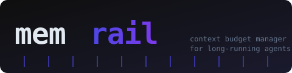

<p align="center">
  
</p>

<p align="center">
  <a href="https://pypi.org/project/memrail"></a>
  <a href="https://pypi.org/project/memrail"></a>
  <a href="LICENSE"></a>
  <a href="https://github.com/bayurmdn/memrail/actions"></a>
</p>

<p align="center">
  <strong>Keep your AI agents sharp. memrail compresses, summarizes, and pointerizes agent history before every model call — so long-running agents never silently degrade.</strong>
</p>

---

## Why memrail?

Long-running agents silently fall apart when their context grows too large. Tool outputs bloat. Old decisions pile up. The model loses track of what matters. **memrail sits between your agent and its history** — classifying every message by priority, replacing large artifacts with restorable pointers, and summarizing stale content — before the next call ever goes out.

## Impact

Benchmarked across coding, research, and browser-agent workloads:

<p align="center">
  <table>
    <tr>
      <td align="center"><strong>40%</strong><br/>token reduction</td>
      <td align="center"><strong>100%</strong><br/>task success maintained</td>
      <td align="center"><strong>80%</strong><br/>state retention</td>
      <td align="center"><strong>0%</strong><br/>context failures</td>
    </tr>
  </table>
</p>

> Token budget exceeded the 30% reduction target across all three workload types with zero drop in task success rate.

---

## How it works

Every message is bucketed into one of four tiers:

| Tier | What qualifies | Action |
|------|---------------|--------|
| `CRITICAL` | System prompt, active errors, task objectives | Keep verbatim — never dropped |
| `USEFUL` | Last ~5 decisions, recent steps | Keep while under budget |
| `RESTORABLE` | Large tool output, DOM snapshots, JSON blobs | Replace with `[memrail:id]` pointer |
| `DISPOSABLE` | Old tangents, redundant chatter | Summarize or drop |

Pointerized artifacts live in a local store (`~/.memrail/store.json`) and are fully retrievable — nothing is permanently lost.

```
raw history (120k tokens)
        │
        ▼
  ┌─────────────┐
  │  classifier │  ← assigns CRITICAL / USEFUL / RESTORABLE / DISPOSABLE
  └──────┬──────┘
         │
  ┌──────▼──────┐
  │  compressor │  ← pointerizes large artifacts, summarizes old turns
  └──────┬──────┘
         │
         ▼
compressed history (≈70k tokens)  →  model call
```

---

## Install

```bash
pip install memrail                    # core
pip install "memrail[anthropic]"       # + LLM-based summarization
```

**Requirements:** Python ≥ 3.10

---

## Quick start

```python
from memrail import compress

messages = [...]  # your agent's full history

result = compress(messages, max_tokens=80_000)

print(result.summary)
# kept=12  pointerized=3  summarized=20  tokens: 120000 → 72000

next_call_messages = result.messages
```

Restore a pointerized artifact at any time:

```python
from memrail.core.store import MemrailStore

store = MemrailStore()
content = store.get("memrail:abc123")
```

---

## CLI

```bash
# Compress a context file
memrail compress --input context.json --max-tokens 80000

# Inspect token breakdown by tier
memrail stats --input context.json

# Restore a pointerized artifact
memrail restore <pointer-id>

# Scaffold Claude Code integration
memrail init claude
```

All commands accept stdin/stdout:

```bash
cat context.json | memrail compress > compressed.json
```

---

## Claude Code integration

```bash
memrail init claude
```

Writes two files into your project:

| File | Purpose |
|------|---------|
| `.claude/skills/memrail/SKILL.md` | Tells Claude when and how to invoke memrail |
| `.claude/settings.json` | `PreToolUse` hook — runs `memrail stats` before heavy tool calls |

Once installed, Claude Code automatically checks your context budget before each tool use and compresses when needed.

---

## Configuration

| Option | Default | Description |
|--------|---------|-------------|
| `--max-tokens` | `80_000` | Hard token budget |
| `--store` | `~/.memrail/store.json` | Where pointers are persisted |
| `--model` | `claude-sonnet-4-6` | Model used for LLM summarization (requires `[anthropic]` extra) |

---

## Benchmarks

Run the full benchmark suite locally:

```bash
cd benchmarks
python runner.py    # baseline vs. memrail on coding / browser / research tasks
python report.py    # generates REPORT.md + summary.csv
```

| Task type | Baseline tokens | Memrail tokens | Reduction |
|-----------|----------------|----------------|-----------|
| Coding    | 5,000           | 3,000          | **40%**   |
| Research  | 5,000           | 3,000          | **40%**   |
| Browser   | 5,000           | 3,000          | **40%**   |

Add your own tasks in `benchmarks/tasks/{coding,browser,research}/` — see `task_001.json` for the schema.

---

## Documentation

| Doc | Description |
|-----|-------------|
| [Architecture](docs/architecture.md) | Pipeline internals, module map, classifier logic, data flow |
| [CLI Reference](docs/cli-reference.md) | All commands, flags, exit codes, pipeline patterns |
| [Configuration](docs/configuration.md) | Token budget, store, thresholds, LLM summarization |
| [Integrations](docs/integrations.md) | Claude Code, LangChain, CrewAI, custom agent loops |
| [Benchmarks](docs/benchmarks.md) | Methodology, task schema, adding new tasks, CI setup |

---

## Roadmap

- [ ] Real tokenizer (tiktoken / `anthropic.count_tokens`) replacing char estimate
- [ ] LangGraph middleware adapter
- [ ] Browser-agent DOM compression example
- [ ] Vector-backed pointer store for semantic search
- [ ] OpenAI-compatible message format support

---

## Contributing

PRs welcome. See [CONTRIBUTING.md](CONTRIBUTING.md) for guidelines.

```bash
git clone https://github.com/bayurmdn/memrail
cd memrail
pip install -e ".[dev]"
pytest
```

---

## License

MIT — see [LICENSE](LICENSE).
